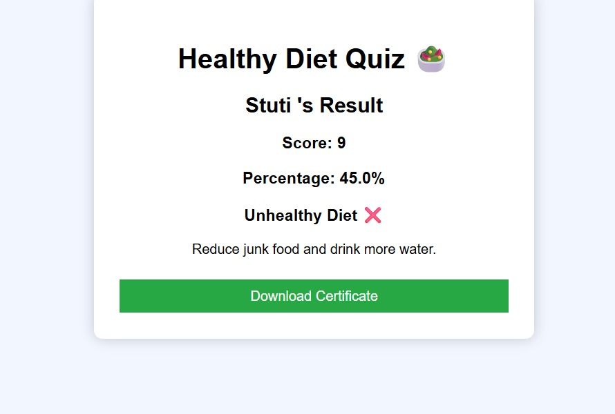

# 🥗 Healthy Diet Quiz

A simple **web-based quiz application** that evaluates users' dietary habits and provides personalized health feedback.

##  Live Demo
🔗 https://stut12.github.io/healthy-diet-quiz

##  Features

- User name input before starting quiz
- Multiple diet related questions
- Progress bar during quiz
- Score calculation
- Percentage based result
- Health tips based on performance
- Certificate download after quiz

##  Technologies Used

- HTML
- CSS
- JavaScript

##  Project Structure
Healthy-Diet-Quiz
│
├── index.html
├── style.css
└── script.js

##  How to Run

1. Download or clone the repository
2. Open the project folder
3. Run **index.html** in your browser
4. Enter your name and start the quiz

##  Purpose of the Project

This project helps users analyze their eating habits and encourages them to follow a **healthy diet** through a simple interactive quiz.

## 👩‍💻 Author

**Stuti Kumari**  
BCA Student  

GitHub: https://github.com/stut12

## Screenshot

